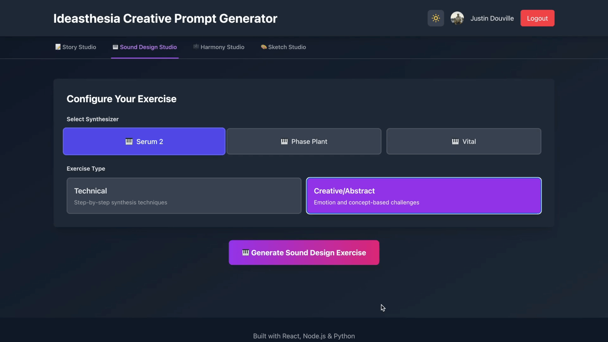

# 🎨 Ideasthesia Creative Prompt Generator

An AI-powered creative training platform that generates exercises for writers and music producers. Built with React, Node.js, Python, and OpenAI's GPT-3.5-turbo, **Ideasthesia** helps you develop your creative skills through structured, AI-generated practice exercises.


---

## ✨ Overview

Ideasthesia combines four specialized creative training modules:

1. **📝 Writing Prompts** - AI-generated writing exercises across multiple genres
2. **🎹 Sound Design** - Technical and creative synthesizer exercises for music producers
3. **🎼 Chord Progressions** - Emotion-based chord progressions with MIDI export
4. **✏️ Drawing Exercises** - Skill-focused drawing practice for artists

Each module includes:
- ⏱️ Built-in countdown timers
- 📊 Difficulty levels and estimated completion times
- 🌙 Full dark mode support
- 💾 Export capabilities (text files, MIDI files)

---

## 📝 Tab 1: Story Studio

Generate AI-powered creative writing exercises tailored to your preferred genres.

### Features

- **10 Exercise Types**:
  - Idea Generation Drills
  - World-Building Techniques
  - Structural Exercises
  - Description Techniques
  - Dialogue Craft
  - Theme & Subtext
  - Genre Convention Study
  - Reverse Engineering
  - Constraint Creativity
  - Revision Techniques

- **18 Genres**: Fantasy, Science Fiction, Mystery, Romance, Thriller, Horror, Historical Fiction, Literary Fiction, Young Adult, Crime, Adventure, Dystopian, Magical Realism, Western, Biography, Self-Help, Philosophy, Poetry

- **Genre Selection**: Choose 1-2 genres for targeted prompts

- **Difficulty Levels** (Weighted Distribution):
  - Very Easy: 30% (250 words)
  - Easy: 30% (500 words)
  - Medium: 25% (750 words)
  - Hard: 15% (1000 words)

- **Writing Interface**:
  - Auto-expanding textarea
  - Live word and character counter
  - Download your writing as `.txt`
  - Progress tracking toward word count goals


---

## 🎹 Tab 2: Sound Design Studio

Synthesizer training exercises for electronic music producers, with genre-specific artist references.

### Features

- **Synthesizers Supported**:
  - Serum 2
  - Phase Plant
  - Vital

- **Exercise Types**:
  - **Technical**: Step-by-step synthesis tutorials inspired by specific artists
  - **Creative/Abstract**: Experimental, literary-inspired sound design exercises

- **Genre Filtering** (Technical Exercises):
  - All Genres
  - Dubstep (24 artists: Skrillex, Virtual Riot, Eptic, Must Die!, etc.)
  - Glitch Hop (23 artists: Tipper, KOAN Sound, Detox Unit, etc.)
  - Drum and Bass (21 artists: Noisia, Mefjus, Alix Perez, etc.)
  - Experimental Bass (19 artists: G Jones, Eprom, Chee, Mr. Bill, etc.)
  - House (24 artists: Chris Lorenzo, Daft Punk, Griz, etc.)
  - Psytrance (26 artists: Infected Mushroom, Astrix, Vini Vici, etc.)
  - Hard Techno (22 artists: Charlotte De Witte, Amelie Lens, etc.)

- **Smart Artist Rotation**: Artists cycle randomly without repetition until all have been used

- **Literary Inspiration** (Creative Exercises): 62 books from sci-fi, fantasy, and literary fiction used as creative prompts

### Example Technical Exercise
```
Title: Skrillex-Style Metallic Bass in Serum 2
Difficulty: Advanced
Time: 45 minutes

Step-by-step synthesis instructions using Serum 2's
oscillators, filters, and effects to recreate
Skrillex's signature aggressive metallic bass sounds...
```


### Example Creative Exercise
```
Title: "Dune" - Desert Atmospheric Texture
Inspired by: Frank Herbert's "Dune"

Create a sound that captures the vastness and danger of
Arrakis. Use reverb and granular synthesis to evoke
endless desert horizons...
```


---

## 🎼 Tab 3: Harmony Studio

Generate emotion-driven chord progressions with theoretical explanations and downloadable MIDI files.

### Features

- **20 Emotions to Choose From**:
  - Melancholy, Elation, Resentment, Awe, Nostalgia
  - Serenity, Apprehension, Defiance, Longing, Tenderness
  - Shame, Triumph, Ambivalence, Existential Dread, Euphoria
  - Loneliness, Vindication, Wonder, Frustration, Disgust

- **Emotion Selection**: Choose 1-2 emotions for nuanced progressions

- **Each Progression Includes**:
  - Chord progression (e.g., "Cmaj7 - Am7 - Fmaj7 - G")
  - Detailed music theory explanation
  - Emotional reasoning for harmonic choices
  - Voice leading and tension/resolution analysis
  - Tonal centers and suggested chord colors
  - Difficulty level (Beginner/Intermediate/Advanced)
  - Estimated practice time (10-20 minutes)

- **MIDI Export**: Download a playable MIDI file for use in your DAW

- **Built-in Timer**: Track your practice time with countdown timer

### Example Progression
```
Emotions: Melancholy + Longing
Progression: Am9 - Fmaj7 - Cmaj7 - G6

Explanation:
This progression uses unresolved minor harmonics to evoke
a sense of unfulfilled yearning. The Am9 opens with rich
emotional tension, while the major 7th chords create moments
of bittersweet hope without providing complete resolution...

Download MIDI → [melancholy_longing.mid]
```


---

## ✏️ Tab 4: Drawing Studio

Generate skill-focused drawing exercises that target fundamental artistic abilities.

### Features

- **7 Core Drawing Skills**:
  - **Observation** - Seeing what's actually in front of you, not what you think is there
  - **Proportion & Scale** - Understanding size relationships between elements
  - **Gesture** - Capturing movement, flow, and energy of a pose
  - **Form (3D Thinking)** - Turning 2D shapes into 3D objects
  - **Light & Shadow** - Understanding how light interacts with form
  - **Line Control & Mark-Making** - Drawing confident, varied lines
  - **Composition** - Arranging elements for maximum visual impact

- **Skill Selection**: Choose 1-2 skills for targeted practice
  - Single skill exercises drill deep into one fundamental
  - Dual skill exercises integrate both skills simultaneously

- **AI-Generated Exercises** with template fallbacks when offline

- **Difficulty Levels**:
  - **Beginner**: 20 minutes - Longer studies for learning foundations
  - **Intermediate**: 10 minutes - Moderate-length focused practice
  - **Advanced**: 1 minute - Quick studies for experienced artists

- **Each Exercise Includes**:
  - Clear, specific instructions
  - Subject matter suggestions
  - Success criteria to self-evaluate
  - 3 practical tips for the exercise
  - Countdown timer with pause/resume

### Example Exercise
```
Skills: Gesture + Form (3D Thinking)
Difficulty: Intermediate
Time: 10 minutes

Exercise: Dynamic Form Sketches

Create quick figure sketches that capture both the energy
of the pose AND the underlying 3D structure of the body.
Use flowing lines to establish gesture, then reinforce
with simple volumes (cylinders, spheres, boxes) to show
form in space.

Success Criteria:
✓ Drawings show clear directional flow and movement
✓ 3D forms are evident beneath the gesture lines
✓ Both skills work together, not separately

Tips:
• Start with the gesture line, then build form around it
• Think of limbs as cylinders in space, torso as boxes
• Notice how gesture affects the compression/expansion of forms
```


---

## 🏗️ Architecture

### Tech Stack

**Frontend:**
- React 18 with Redux Toolkit
- Tailwind CSS for styling
- Google OAuth 2.0 authentication
- OpenTelemetry for observability

**Backend (Node.js):**
- Express.js server
- PostgreSQL database
- Redis for caching and artist rotation
- JWT authentication
- OpenTelemetry tracing

**Prompt Generation Service (Python):**
- Flask API
- OpenAI GPT-3.5-turbo integration
- MIDIUtil for MIDI file generation
- Content sanitization to prevent AI hallucinations
- Redis-based randomization for artists and books

**Infrastructure:**
- Docker & Docker Compose
- OpenTelemetry Collector
- Prometheus for metrics
- Grafana for monitoring dashboards
- Jenkins for CI/CD (optional)

---

## 🚀 Getting Started

### Prerequisites

- **Docker** and **Docker Compose** installed
- **Google OAuth** credentials ([Google Cloud Console](https://console.cloud.google.com/))
- **OpenAI API key** ([OpenAI Platform](https://platform.openai.com/))

### Installation Steps

#### 1. Clone the Repository

```bash
git clone https://github.com/YOUR_USERNAME/ideasthesia-creative-prompt-generator.git
cd ideasthesia-creative-prompt-generator
```

#### 2. Set Up Environment Variables

Create a `.env` file in the root directory:

```env
# Database
POSTGRES_USER=promptuser
POSTGRES_PASSWORD=your-secure-password
POSTGRES_DB=writingprompts

# Backend
JWT_SECRET=your-super-secret-jwt-key-change-this-to-something-random
NODE_ENV=development

# Google OAuth
GOOGLE_CLIENT_ID=your-google-client-id.apps.googleusercontent.com
GOOGLE_CLIENT_SECRET=your-google-client-secret

# OpenAI
OPENAI_API_KEY=sk-your-openai-api-key

# Redis
REDIS_URL=redis://redis:6379
```

#### 3. Get Google OAuth Credentials

1. Go to [Google Cloud Console](https://console.cloud.google.com/)
2. Create a new project or select an existing one
3. Enable the **Google+ API**
4. Navigate to **Credentials** → **Create Credentials** → **OAuth 2.0 Client ID**
5. Configure authorized redirect URIs:
   - `http://localhost:4000/api/auth/google/callback`
   - `http://localhost:3000`
6. Copy your **Client ID** and **Client Secret** to `.env`

#### 4. Get OpenAI API Key

1. Sign up at [OpenAI Platform](https://platform.openai.com/)
2. Go to [API Keys](https://platform.openai.com/api-keys)
3. Create a new API key
4. **Add credits** to your OpenAI account (required for API usage)
5. Copy the key to your `.env` file

#### 5. Start the Application

```bash
# Build and start all services
docker-compose up -d --build

# View logs (optional)
docker-compose logs -f

# Stop all services
docker-compose down
```

#### 6. Initialize the Database

```bash
# Run the database setup script
bash scripts/setup-db.sh
```

#### 7. Access the Application

Open your browser and navigate to:

- **Frontend Application**: http://localhost:3000
- **Backend API**: http://localhost:4000
- **Prompt Service**: http://localhost:5001
- **Grafana Dashboard**: http://localhost:3001 (login: admin/admin)
- **Prometheus Metrics**: http://localhost:9090
- **Jenkins CI/CD**: http://localhost:8080

---

## 📁 Project Structure

```
ideasthesia-creative-prompt-generator/
├── frontend/                   # React frontend application
│   ├── src/
│   │   ├── components/
│   │   │   ├── PromptDisplay.js               # Writing prompt display
│   │   │   ├── SoundDesignPromptDisplay.js    # Sound design display
│   │   │   ├── ChordProgressionPromptDisplay.js  # Chord progression display
│   │   │   ├── SynthSelector.js               # Synthesizer selector
│   │   │   └── BookBackground.js              # Decorative background
│   │   ├── store/                             # Redux store
│   │   │   ├── authSlice.js                   # Authentication state
│   │   │   ├── promptSlice.js                 # Writing prompts state
│   │   │   └── soundDesignSlice.js            # Sound design state
│   │   ├── contexts/
│   │   │   └── ThemeContext.js                # Dark mode context
│   │   ├── App.js                             # Main application
│   │   └── index.js
│   ├── Dockerfile
│   └── package.json
│
├── backend/                    # Node.js Express backend
│   ├── server.js              # Main server (API endpoints)
│   ├── Dockerfile
│   └── package.json
│
├── prompt-service/             # Python Flask prompt generation
│   ├── app.py                 # Flask API (OpenAI integration, MIDI generation)
│   ├── requirements.txt       # Python dependencies (includes midiutil)
│   └── Dockerfile
│
├── monitoring/                 # Observability configuration
│   ├── otel/
│   │   └── otel-config.yaml   # OpenTelemetry Collector config
│   ├── prometheus/
│   │   └── prometheus.yml     # Prometheus scrape config
│   └── grafana/
│       └── dashboards/        # Pre-configured dashboards
│
├── scripts/
│   └── setup-db.sh            # Database initialization script
│
├── docker-compose.yml          # Docker orchestration
├── .env                        # Environment variables (create this)
└── README.md                   # This file
```

---

## 🔧 Development

### Running Services Individually

**Frontend:**
```bash
cd frontend
npm install
npm start  # Runs on http://localhost:3000
```

**Backend:**
```bash
cd backend
npm install
node server.js  # Runs on http://localhost:4000
```

**Prompt Service:**
```bash
cd prompt-service
pip install -r requirements.txt
python app.py  # Runs on http://localhost:5001
```

### Rebuilding Specific Services

```bash
# Rebuild and restart the frontend
docker-compose up -d --build frontend

# Rebuild and restart the backend
docker-compose up -d --build backend

# Rebuild and restart the prompt service
docker-compose up -d --build prompt-service

# Rebuild everything from scratch
docker-compose down -v
docker-compose up -d --build
```

### Viewing Logs

```bash
# View all logs
docker-compose logs -f

# View specific service logs
docker-compose logs -f frontend
docker-compose logs -f backend
docker-compose logs -f prompt-service
docker-compose logs -f redis

# View last 50 lines
docker-compose logs --tail=50 backend
```

---

## 🎨 Customization

### Adding New Writing Exercise Types

Edit `prompt-service/app.py` and add your exercise type to the `exercise_types` array:

```python
exercise_types = [
    "Idea Generation Drills",
    "Your New Exercise Type",
    # ... existing types
]
```

### Adding New Genres

Edit `frontend/src/App.js`:

```javascript
const genres = [
  'Fantasy', 'Science Fiction', 'Your New Genre',
  // ... existing genres
];
```

### Adding New Emotions (Chord Progressions)

Edit `prompt-service/app.py` in the `EMOTIONS` array:

```python
EMOTIONS = [
    {
        "emotion": "Your Emotion",
        "tonal_center": "C major or A minor",
        "chord_colors": ["maj7", "add9"],
        "notes_for_generation": "Description for AI..."
    },
    # ... existing emotions
]
```

### Adding New Artists (Sound Design)

Edit the `artists_by_genre` dictionary in `prompt-service/app.py`:

```python
artists_by_genre = {
    'dubstep': ['Skrillex', 'Your Artist', ...],
    # ... other genres
}
```

### Changing Difficulty Distribution

Modify the `get_random_word_count_and_difficulty()` function in `prompt-service/app.py`:

```python
difficulties = [
    ('Very Easy', 250, 0.30),  # 30% chance
    ('Easy', 500, 0.30),       # 30% chance
    ('Medium', 750, 0.25),     # 25% chance
    ('Hard', 1000, 0.15)       # 15% chance
]
```

---

## 🐛 Troubleshooting

### Common Issues

#### 1. Containers Won't Start

```bash
# Check container status
docker-compose ps

# View error logs
docker-compose logs backend
docker-compose logs prompt-service

# Restart a specific service
docker-compose restart backend
```

#### 2. Database Connection Errors

```bash
# Connect to PostgreSQL
docker-compose exec postgres psql -U promptuser -d writingprompts

# List tables
\dt

# View table contents
SELECT * FROM users;
SELECT * FROM prompts;

# Exit psql
\q
```

#### 3. OpenAI API Errors

- **"Insufficient credits"**: Add credits at [OpenAI Billing](https://platform.openai.com/account/billing)
- **"Invalid API key"**: Verify `OPENAI_API_KEY` in `.env`
- **Rate limit errors**: OpenAI has rate limits based on your plan
- Check logs: `docker-compose logs prompt-service`

#### 4. Google OAuth Not Working

- Verify `GOOGLE_CLIENT_ID` and `GOOGLE_CLIENT_SECRET` in `.env`
- Check authorized redirect URIs match: `http://localhost:3000` and `http://localhost:4000/api/auth/google/callback`
- Ensure Google+ API is enabled in your Google Cloud project

#### 5. Frontend Not Loading

```bash
# Check if port 3000 is already in use
lsof -i :3000

# Rebuild frontend
docker-compose up -d --build frontend

# Check frontend logs
docker-compose logs -f frontend
```

#### 6. MIDI Download Not Working

- Check browser console for errors
- Verify `midiutil` is installed: `docker-compose exec prompt-service pip list | grep midiutil`
- Check prompt-service logs: `docker-compose logs prompt-service`

---

## 📊 Monitoring & Observability

### Prometheus Metrics

Access Prometheus at http://localhost:9090

Available metrics include:
- API request counts and latencies
- OpenAI API call metrics
- Redis cache hit/miss rates
- System resource usage

### Grafana Dashboards

Access Grafana at http://localhost:3001 (login: admin/admin)

Pre-configured dashboards:
- Application Overview
- API Performance
- Database Metrics
- OpenTelemetry Traces

### OpenTelemetry Traces

The OpenTelemetry Collector receives traces from all services and exports them to Prometheus. View traces in Grafana or use the debug exporter to see traces in logs:

```bash
docker-compose logs otel-collector
```

---

## 🔐 Security Notes

- **Change default passwords** in `.env` before deploying
- **Never commit `.env`** to version control
- **Rotate JWT_SECRET** regularly in production
- **Use environment-specific** Google OAuth credentials
- **Secure your OpenAI API key** - it costs money per request
- **Set up rate limiting** for production deployments

---

## 🤝 Contributing

Contributions are welcome! Please follow these steps:

1. Fork the repository
2. Create a feature branch:
   ```bash
   git checkout -b feature/amazing-feature
   ```
3. Commit your changes:
   ```bash
   git commit -m 'Add amazing feature'
   ```
4. Push to the branch:
   ```bash
   git push origin feature/amazing-feature
   ```
5. Open a Pull Request

### Development Guidelines

- Follow existing code style (ESLint for JS, PEP8 for Python)
- Add tests for new features
- Update documentation as needed
- Test with Docker before submitting PR

---

## 📝 License

This project is licensed under the MIT License - see the [LICENSE](LICENSE) file for details.

---

## 🙏 Acknowledgments

- **OpenAI** for GPT-3.5-turbo API
- **Google** for OAuth authentication
- **The music production community** for artist references
- **Literary community** for creative inspiration
- **Open-source community** for tools and libraries:
  - React, Redux, Tailwind CSS
  - Express.js, Flask
  - PostgreSQL, Redis
  - Docker, Prometheus, Grafana
  - MIDIUtil, OpenTelemetry

---

## 📧 Support

If you encounter issues or have questions:

1. Check the [Troubleshooting](#-troubleshooting) section
3. [Open a new issue](https://github.com/jdouville8/ideasthesia-creative-prompt-generator/issues/new) with:
   - Detailed description of the problem
   - Steps to reproduce
   - Relevant logs (`docker-compose logs`)
   - Your environment (OS, Docker version, etc.)

---

## 🎯 Roadmap

### Planned Features

- [ ] User prompt history and favorites
- [ ] More synthesizers (Operator, Massive X, Arturia Pigments)
- [ ] Scale and mode suggestions for chord progressions
- [ ] Audio examples for sound design exercises
- [ ] Mobile-responsive design improvements
- [ ] Export chord progressions as PDF sheet music
- [ ] Progress tracking and analytics

---

*Ideasthesia (noun): A neurological phenomenon in which stimulation of one sense involuntarily triggers experiences in another sense.*
